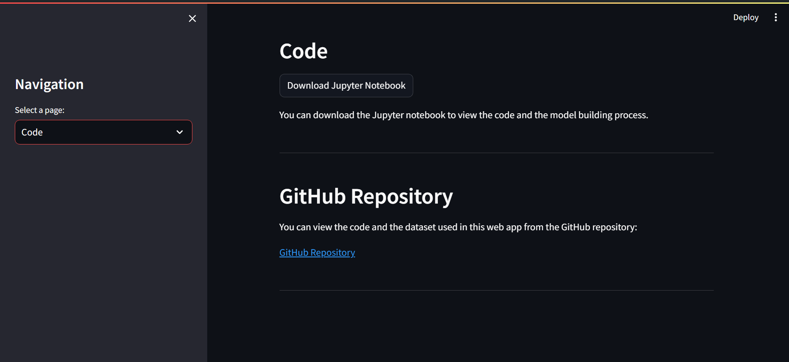

# Plant Disease Prediction

This is a web app for predicting plant diseases using Convolutional Neural Networks (CNN).
The model is trained on the PlantVillage dataset which contains images of healthy and diseased plant leaves.
The dataset consists of 38 classes of plant diseases.
The model is built using TensorFlow and Keras and trained on Google Colab.

